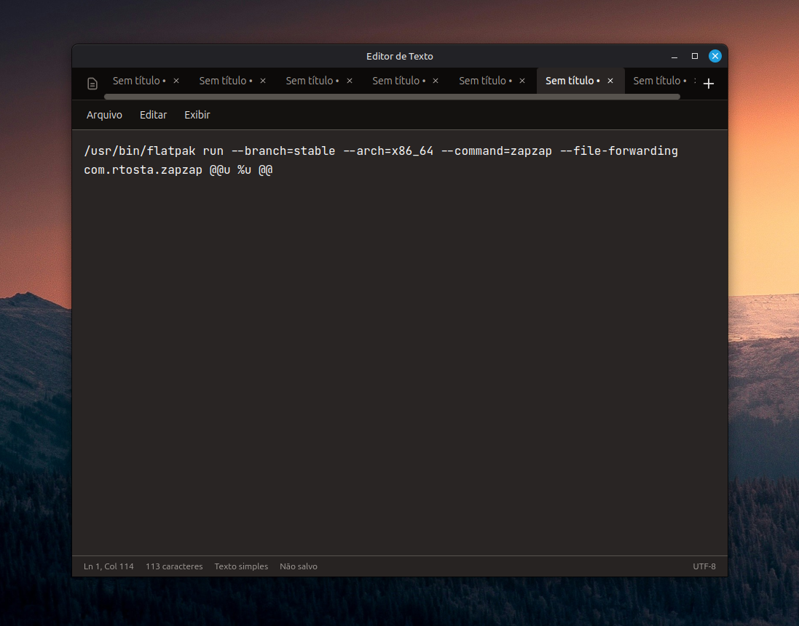

# 📝 Editor de Texto

[](https://opensource.org/licenses/MIT)
[](https://www.electronjs.org/)
[](https://tailwindcss.com/)

**[⬇️ Baixar última versão (Windows, Linux, macOS)](https://github.com/jonathanjua/app_txt/releases/)**

Editor de texto simples e moderno construído com Electron, HTML, JavaScript e Tailwind CSS. Interface limpa com suporte a múltiplas abas, temas claro/escuro e persistência automática de documentos não salvos.

### Sobre o projeto

Sempre gostei muito do Bloco de Notas do Windows. Acabei criando este projeto para ter algo parecido e útil no dia a dia — hoje uso Linux e o app tem me ajudado bastante. Espero que possa ajudar outras pessoas também.

O projeto não foi pensado para usar “a melhor tecnologia” de mercado; resolvi usar as stacks que já domino (Electron, HTML, JS, Tailwind) para entregar algo funcional e que eu consiga manter com tranquilidade.

## ✨ Funcionalidades

- 📑 **Múltiplas abas** – Edite vários arquivos simultaneamente
- 💾 **Persistência automática** – Documentos não salvos são guardados e restaurados ao reabrir o app
- 🌓 **Temas claro/escuro** – Alternância rápida entre temas
- ⌨️ **Atalhos de teclado** – Navegação e edição eficiente
- 📊 **Barra de status** – Mostra linha, coluna e contagem de caracteres
- 🎨 **Interface moderna** – Design limpo inspirado em editores profissionais
- 🚀 **100% offline** – Todas as dependências incluídas (Tailwind e fontes locais)
- 🔒 **Seguro** – Sandbox ativado, context isolation e operações de arquivo no processo principal

## 🖼️ Capturas de Tela



## 🚀 Instalação

**Quer só usar o app?** Baixe o instalável da [última release](https://github.com/jonathanjua/app_txt/releases/) (`.exe` no Windows, `.AppImage`/`.deb` no Linux, `.dmg` no macOS).

### Pré-requisitos (para rodar do código-fonte)

- Node.js 16+ e npm

### Desenvolvimento

```bash
# Clone o repositório
git clone https://github.com/jonathanjua/app-txt.git
cd app-txt

# Instale as dependências
npm install

# Execute o app
npm start
```

O CSS do Tailwind é gerado automaticamente antes de iniciar (`prestart`).

## 📦 Build e Distribuição

### 🔨 Build Local

#### Build para todas as plataformas

```bash
npm run build
```

Gera o instalável para o sistema atual (Linux, Windows ou macOS) na pasta `dist/`.

#### Build por plataforma específica

```bash
# Windows (instalador NSIS)
npm run build:win

# Linux (AppImage e .deb)
npm run build:linux

# macOS (.dmg)
npm run build:mac
```

#### Instalação no Linux

Após o build local, você pode:

- **Executar o AppImage diretamente:**
  ```bash
  chmod +x "dist/Editor de Texto-1.0.0.AppImage"
  ./dist/Editor\ de\ Texto-1.0.0.AppImage
  ```

- **Instalar o pacote .deb:**
  ```bash
  sudo dpkg -i dist/app-txt_1.0.0_amd64.deb
  ```

## ⌨️ Atalhos de Teclado

| Atalho | Ação |
|--------|------|
| `Ctrl+N` / `Cmd+N` | Novo documento |
| `Ctrl+O` / `Cmd+O` | Abrir arquivo |
| `Ctrl+S` / `Cmd+S` | Salvar |
| `Ctrl+W` / `Cmd+W` | Fechar aba |

## 📁 Estrutura do Projeto

```
app-txt/
├── .github/
│   ├── workflows/
│   │   └── build.yml      # CI: build para Windows, Linux e macOS
│   └── RELEASE.md
├── assets/
│   ├── css/
│   │   ├── input.css      # Entrada do Tailwind
│   │   └── overrides.css  # Estilos customizados
│   └── icon.png           # Ícone do app
├── scripts/
│   ├── copy-icon.js       # Cópia do ícone para build
│   └── release.js         # Script de release
├── main.js                # Processo principal do Electron
├── preload.js             # Script de preload (bridge seguro)
├── renderer.js            # Lógica do editor (renderer)
├── index.html             # Interface do app
├── tailwind.config.js     # Configuração do Tailwind
├── package.json
├── package-lock.json
├── LICENSE
├── Capturadetela.png      # Screenshot do app (README)
├── .gitignore
└── README.md
```

## 🛠️ Tecnologias

- **Electron** – Framework para apps desktop multiplataforma
- **Tailwind CSS** – Framework CSS utilitário
- **JetBrains Mono** – Fonte monoespaçada
- **electron-builder** – Empacotamento e distribuição

## ⚡ Desempenho

O app inclui várias otimizações:

- ✅ **Sandbox** no renderer com operações de arquivo via IPC
- ✅ **Debounce** na barra de status (60ms) durante digitação
- ✅ **CSS minificado** e fontes locais (100% offline)
- ✅ **Spellcheck desativado** para reduzir uso de recursos
- ✅ **DevTools** só em desenvolvimento

## 📝 Uso

1. **Criar novo documento:** Clique em "Novo" ou use `Ctrl+N`
2. **Abrir arquivo:** Clique em "Abrir" ou use `Ctrl+O`
3. **Salvar:** Use `Ctrl+S` ou clique em "Salvar"
4. **Salvar como:** Use o menu Arquivo → "Salvar como..."
5. **Alternar tema:** Clique no ícone de sol/lua na barra superior
6. **Fechar aba:** Clique no ✕ na aba ou use `Ctrl+W`

### Documentos não salvos

Documentos sem salvar são automaticamente guardados no `localStorage` e restaurados quando você reabre o app. Abas vazias são fechadas sem confirmação.

## 🤝 Contribuindo

Contribuições são bem-vindas! Sinta-se à vontade para:

1. Fazer fork do projeto
2. Criar uma branch para sua feature (`git checkout -b feature/AmazingFeature`)
3. Commit suas mudanças (`git commit -m 'Add some AmazingFeature'`)
4. Push para a branch (`git push origin feature/AmazingFeature`)
5. Abrir um Pull Request

## 📄 Licença

Este projeto está licenciado sob a Licença MIT - veja o arquivo [LICENSE](LICENSE) para detalhes.

## 👤 Autor

**Jonathan de Almeida**

- Email: jonathan.almeida@gmail.com
- GitHub: [@jonathanjua](https://github.com/jonathanjua)

## 🙏 Agradecimentos

- [Electron](https://www.electronjs.org/) pela plataforma incrível
- [Tailwind CSS](https://tailwindcss.com/) pelo framework CSS
- [Fontsource](https://fontsource.org/) pelas fontes self-hosted
- [JetBrains Mono](https://www.jetbrains.com/lp/mono/) pela fonte monoespaçada

---

⭐ Se este projeto foi útil para você, considere dar uma estrela no GitHub!
